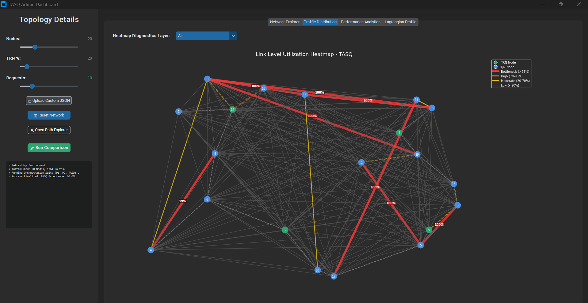

# Traffic-Aware QKD Key Orchestration Dashboard 

**TASQ** is a high-performance orchestration framework for next-generation Quantum Communication Infrastructures (QCI). This repository provides the standalone TASQ Admin Dashboard for network monitoring, bottleneck analysis, and algorithm benchmarking.

## 🚀 Key Features
*   **Layered Visualization**: Isolate QKP-Enabled segments, Bypass links, and Direct Physical fibers.
*   **Real-time Heatmaps**: Identify network bottlenecks with 95%+ utilization alerts.
*   **Multi-Solver Benchmark**: Side-by-side performance analysis of TASQ, P1, and P2 models.
*   **Path Explorer**: Detailed hop-by-hop auditing of On-Demand and Stored-Key routes.

## 📥 Download & Installation (Windows)
1. Go to the **[Releases](../../releases)** tab on this repository.
2. Download the latest **`TASQ_Dashboard_v1.0.zip`**.
3. Extract the ZIP file and run the `TASQ_Dashboard.exe`. 
4. **No installation or Python environment required.**

> [!TIP]
> **Windows Security Note:** As this is a custom research tool, Windows SmartScreen may show an "Unrecognized App" warning. To run the application, click **'More info'** and then **'Run anyway'**.

## 📖 Quick Start
1. **Load Topology**: Use the "Reset Network" button to generate a random graph, or upload your own `.json` topology.
2. **Run Orchestration**: Click "Run Comparison" to execute the TASQ, P1, and P2 solvers.
3. **Analyze**: Toggle between the "Traffic Distribution" and "Performance Analytics" tabs to evaluate network efficiency.

## ⚖️ Intellectual Property & License
Copyright © 2026. All Rights Reserved.
This application is provided as a compiled binary for research and evaluation purposes. The source code is proprietary and is not included in this public repository.
